# Athlete Management System

An end-to-end athlete monitoring platform on **Snowflake + dbt** that tracks everything an athlete
needs (training load, sleep, nutrition, HRV and wellness, physical testing, injuries, match
performance) and then answers two questions a coach actually asks:

1. **Who is about to get hurt?** A calibrated 7-day injury-risk model, with the reasons shown.
2. **What is each athlete missing, and what does he need *more* of to perform better?** A
   counterfactual engine that re-scores the models with one lever changed at a time (sleep,
   protein, carbs, hydration, load, aerobic capacity, speed, power, strength, hamstring strength) and ranks
   levers by expected gain in match rating and drop in injury risk.

> **Everything runs locally with one command and zero cost** (DuckDB), and the same dbt project
> targets Snowflake. The data is **synthetic by design**, see [Why synthetic data](#why-synthetic-data-and-what-that-does-and-does-not-prove).

```bash
pip install -r requirements.txt
make all        # simulate -> load -> dbt (models + tests) -> train -> recommend -> dbt (post-ML marts), ~1 min
make test       # python tests
make app        # dashboard on http://localhost:8501
```

## Results (held-out Apr–Sep 2026; never used for training, tuning or calibration)

| Model | Metric | Result | Baseline(s) |
|---|---|---|---|
| Injury risk, next 7 days | ROC-AUC | **0.846** | 0.734 (ACWR rule only), 0.815 (logistic, 7 features) |
| | PR-AUC (base rate 6.3%) | **0.353** | 0.279 (logistic) |
| | Lift in top 5% of risk | **6.9x** (35% of injuries caught) | n/a |
| Match rating | MAE (rating pts) | **0.424**, R² 0.70 | 0.559 / 0.47 (recent form), 0.435 / 0.685 (ridge), 0.780 (league mean) |

Honest reading: the gradient-boosted performance model beats "recent form" clearly but is only
marginally better than a ridge regression, because the simulated world is mostly additive. A real
dataset with interactions would be a fairer test of the non-linear model.

### Does the recommendation engine find the *true* effects?

Because the data is simulated, the true effect of every lever is known (`data_gen/causal.py`), so the engine
is scored against ground truth (`ml/recommend.py`, stored in `ml.recommendation_validation`):

| Check | Result |
|---|---|
| Rank correlation, estimated vs true rating gain (pooled over athlete×lever) | **0.69** |
| Rank correlation, estimated vs true relative injury-risk reduction | **0.59** |
| Median **within-lever** rank correlation (does it know *which athletes* benefit most from a given lever?) | **0.46** |
| True #1 lever is inside the model's top 3 | **98%** |
| Sign of the effect correct (where true effect is non-trivial) | 79% |
| True #1 lever == model's #1 lever | 85%, **vs 81% for the lazy "tell everyone the same lever" baseline** |

Two things this table is deliberately honest about:

* **The top-1 number is mostly sleep dominating.** Sleep is the best lever for most athletes in this world, so
  a lazy baseline already scores 81%. The within-lever correlation (0.46) is the harder, more meaningful test.
* **Magnitudes are attenuated; rankings are better than sizes.** The engine estimates +0.11 rating for fixing
  sleep (true: +0.14) but only +0.01 for protein (true: +0.08). Nutrition is self-reported on ~70% of days with noise,
  so effects get diluted toward zero (classic errors-in-variables). Treat the numbers as *priorities*, not forecasts.

## Architecture

```mermaid
flowchart LR
  subgraph Sources["Source systems (parquet extracts)"]
    A[GPS + session RPE] & B[Wearable sleep] & C[Wellness / HRV] & D[Nutrition log] & E[Medical / injuries] & F[Match stats + fixtures] & G[Physical tests]
  end
  Sources -->|COPY INTO / write_pandas| RAW[(RAW)]
  RAW --> STG[STAGING<br/>dedupe, units, sensor-glitch rules]
  STG --> INT[INTERMEDIATE<br/>dense athlete-day spine<br/>rolling load / ACWR / recovery windows]
  INT --> MARTS[MARTS<br/>dims, facts, benchmarks,<br/>gap analysis, ML feature marts]
  MARTS --> ML[Python ML<br/>injury model + performance model<br/>counterfactual lever engine]
  ML -->|write back| MLS[(ML schema)]
  MLS --> POST[POST-ML MARTS<br/>action plan, risk timeline, squad view]
  MARTS --> APP[Streamlit dashboard]
  POST --> APP
  SEEDS[Seeds: evidence targets,<br/>lever catalog, position groups] --> MARTS
  SEEDS --> ML
```



Design choices worth defending:

* **Two-phase dbt build.** `pre_ml` builds everything that does not need model output, Python trains and writes to
  `ml.*`, then `post_ml` joins results back. Business logic stays in SQL/seeds; Python only does what SQL cannot.
* **One source of truth for features.** The feature list lives in a single dbt macro
  (`ml_feature_columns`); Python treats every non-metadata numeric column as a feature. Add a feature in dbt, retrain, done.
* **Business rules in seeds, not code.** Evidence-based targets, lever definitions (which features each lever moves,
  step size, coaching wording) are CSV seeds a sports scientist can edit in a pull request.
* **Dual-target dbt project** (DuckDB for dev/CI, Snowflake for prod) using adapter-dispatched macros and portable SQL
  (`qualify`, `ignore nulls`, `dbt.dateadd/datediff`).
* **Snowflake least-privilege setup**: separate loader / transformer / ML / analyst roles, separate warehouses, resource monitor.

## Data modelling and the one thing that makes rolling-window ML correct

Rolling features are only right on a **dense** athlete×day grain (`int_athlete_day_spine`): on a sparse table,
"the last 7 rows" is not "the last 7 days". Every feature follows an explicit timing convention
(`macros/windows.sql`) so nothing a coach could not know on the morning of day *t* leaks into day *t*'s features:

| Signal | Window | Why |
|---|---|---|
| Training load, nutrition | rows *t-n … t-1* | known only after the day ends |
| Sleep, HRV, wellness | rows *t-n+1 … t* | measured on the morning of *t* |
| Physical tests | latest on/before *t* | carried forward |
| Fixtures in next 7 days | *t … t+6* | public schedule, not an outcome |
| Injury label | *t … t+6* | labels only, never features |

This is enforced three ways: a **dbt unit test** with mocked inputs, a singular test that **re-derives ACWR
independently with `LAG()`** and compares to the window-frame version on every row, and a Python test that no
feature name resembles a label. (The first draft of the simulator also produced 3-hour training sessions; a dbt range test
caught it and the generator was fixed rather than the test loosened.)

## Data quality

The raw feeds contain realistic defects, handled and tested in staging: duplicate deliveries (dedupe on
`_loaded_at`), two GPS vendors with different speed units (m/s vs km/h, covered by a unit test), sensor glitches
(99.9 km/h, HRV of 0 or 999), device failures (GPS NULL but session load kept), incomplete self-reporting, and
integrity rules across feeds (no non-rehab sessions while injured, no overlapping injuries).

**102 data tests + 2 unit tests** (dbt) and **17 Python tests**, all run in CI (`.github/workflows/ci.yml`).

## ML details

* **Injury model**: histogram gradient boosting, strict time split (train ≤ Dec 2025, val Jan–Mar 2026, test Apr–Sep 2026),
  iteration count chosen on validation log-loss, **Platt calibration** on validation. Platt rather than isotonic on purpose:
  isotonic is a step function and flattened counterfactual effects to exactly zero (found and fixed during development).
* **Monotonic constraints** from domain priors (more sleep never raises injury risk, etc.) so counterfactuals are physiologically
  sensible. They are priors I chose, and are listed in `ml/config.py`.
* **Gap analysis** (`mart_athlete_gap_analysis`): current value vs an evidence-based target (sleep, protein, carbs, hydration,
  ACWR band, hamstring strength) or, for physical tests with no universal norm, the median of top-quartile performers in the
  athlete's position group (`mart_position_benchmarks`).
* **Counterfactual engine**: step sizes are capped at each athlete's real shortfall, effects averaged over the last 14
  available days to reduce noise, ranked by `0.5·(rating gain) + 0.5·(risk reduction)` (both normalised).

## Why synthetic data, and what that does and does not prove

No real athlete-monitoring dataset combines GPS, sleep, nutrition, HRV, medical and match data at this granularity, and
real medical data cannot be published. The simulator (`data_gen/`) builds a league of 8 teams × 30 athletes over 27 months
(**632K raw rows**, 180K athlete-days, 1,193 injuries, 12.8K match appearances) from an explicit causal model:
load spikes, sleep debt, protein shortfall, weak hamstrings and injury history raise injury hazard; sleep, fuelling, fitness
and load balance move match ratings; lifestyle "conscientiousness" confounds sleep, nutrition and training habits;
unobserved frailty exists that no model can see.

**What it proves:** the engineering (modelling, tests, leakage control, two-target dbt, warehouse design), and that the
engine can recover *known* effects through confounding, noise and missing data, which is checkable only because truth is known.

**What it does not prove:** that these relationships hold in real athletes, or that metrics like AUC 0.85 would transfer.
Real data would be noisier. The code is structured so real feeds replace `data_gen/` at the RAW layer with no downstream changes.

## Limitations

* **Observational, not causal.** Counterfactuals read the model, not a trial. In real data, confounding (athletes who sleep
  well also train well) would bias them; the monotonic constraints and capped steps reduce, not remove, that risk.
* **Evidence targets are general guidance** (`seed_evidence_targets.csv`), not individual prescriptions. A club's physician and
  dietitian should replace them.
* **Calibration is good on average but compressed at the extremes.** Mean predicted risk on the test window is 6.0% vs 6.3% observed, but
  the lowest-risk deciles are over-predicted (0.8% vs 0.5%) and the top decile under-predicted (29% vs 32%). The test window also has a
  higher base rate (6.3%) than the calibration window (4.9%) because of pre-season load spikes. The dashboard plots this instead of hiding it;
  production use would need periodic recalibration.
* **Snowflake path is verified at parse level only.** The DuckDB path is executed and tested end to end; CI runs `dbt parse`
  against the Snowflake adapter, but I could not execute against a live Snowflake account. Expect to fix small dialect issues on
  first run (the Snowflake calendar macro and `warehouse/load_raw.py` are the likeliest places).
* Body mass is static (roster value) when computing g/kg; features are built for football (soccer) conventions.

## Using it on Snowflake

```bash
pip install -r requirements.txt -r requirements-snowflake.txt
# 1. run warehouse/snowflake/00_setup.sql and 01_raw_tables.sql as ACCOUNTADMIN, create a service user
export WAREHOUSE=snowflake DBT_TARGET=snowflake
export SNOWFLAKE_ACCOUNT=... SNOWFLAKE_USER=... SNOWFLAKE_PASSWORD=...
make data
make load        # write_pandas into RAW  (or PUT + COPY INTO via warehouse/snowflake/02_load_from_stage.sql)
make dbt-pre && make ml && make dbt-post
WAREHOUSE=snowflake make app
```

## Repository layout

```
data_gen/        causal.py (ground-truth DGP) + generate.py (simulator, raw feeds with injected defects)
warehouse/       conn.py (DuckDB/Snowflake), load_raw.py, snowflake/ (roles, warehouses, DDL, COPY INTO)
dbt/             models/{staging,intermediate,marts,marts/post_ml}, seeds/, macros/, tests/{generic,singular}, selectors.yml
ml/              train.py, recommend.py, levers.py, calibration.py, config.py
app/             streamlit_app.py  (squad, athlete, squad-needs, model-quality tabs)
tests/           pytest: ground-truth model, lever logic, pipeline-output integration checks
.github/         CI: full pipeline on DuckDB + Snowflake-adapter parse
```

## Next steps if this were a real club

Incremental models for the rolling features, a feature store for point-in-time correctness at scale, model monitoring (drift in
calibration and feature distributions), replacing synthetic feeds with real vendor ingestion, a role-based data-access policy for
medical detail, and a randomized or quasi-experimental rollout to measure whether the recommendations actually help.
